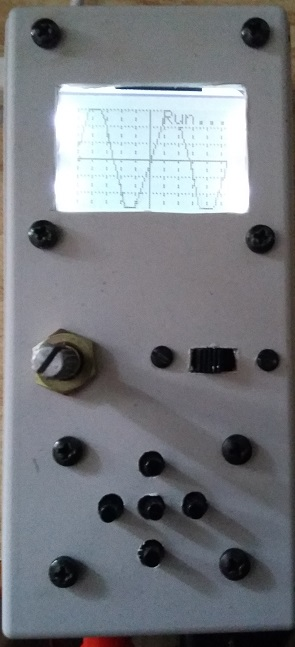

# arduino_scope_200Ksps
arduino scope with nokia display

-uses arduino adc for sampling at 200000 samples per second, 6 bits resolution.

-you can see a signals up to 20KHz.

-software triggering

-ac/dc input

-yposition with a pot

-5 buttons for menu navigation
